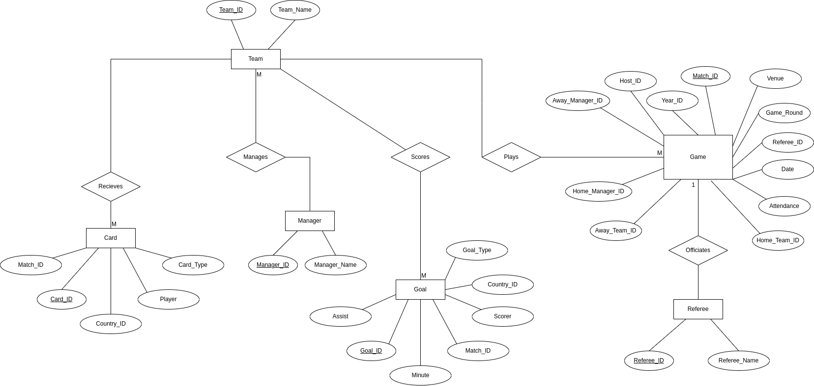

**<p style="text-align: center; font-size: 40px;">ISYS2014 - Database Systems</p>**

<p></p>

***<p style="text-align: center; font-size: 30px;">Final Assignment</p>***

<p>&nbsp;</p>
<p>&nbsp;</p>
<p>&nbsp;</p>
<p>&nbsp;</p>
<p>&nbsp;</p>
<p>&nbsp;</p>
<p>&nbsp;</p>
<p>&nbsp;</p>
<p>&nbsp;</p>


***<p style="text-align: center; font-size: 30px;">Assignment Report</p>***


<p>&nbsp;</p>
<p>&nbsp;</p>
<p>&nbsp;</p>
<p>&nbsp;</p>
<p>&nbsp;</p>
<p>&nbsp;</p>
<p>&nbsp;</p>
<p>&nbsp;</p>


---------------------------------------------------------
#### By: Sauban Kidwai
#### ID: 20748199
#### Practical Class (Building: 314.114 | Time: 4pm - 6pm | Day: Every Wednesday)
----------------------------------------------------------


<div style="page-break-after: always"></div>


# Table of contents
- [Table of contents](#table-of-contents)
- [Introduction](#introduction)
- [How to Use](#how-to-use)
- [File Descriptions](#file-descriptions)
- [Database Design](#database-design)
- [Database Implementation](#database-implementation)
- [Design and Implementation of Queries](#design-and-implementation-of-queries)
- [Design and Implementation of Advanced Queries](#design-and-implementation-of-advanced-queries)
- [Database Connectivity and Python Implementation](#database-connectivity-and-python-implementation)
- [Discussion](#discussion)


<div style="page-break-after: always"></div>


# Introduction
This Assignment involved the use of SQL Queries in a Linux Environment through the MySQL Server. For this assignment, there were 2 datasets to choose from. Nobel Prize Winners and the FIFA Womens World Cup 2023. This assignment focuses on the FIFA Womens World CUp 2023 as the chosen dataset. In this assignment 6 tables were created and over 192 insert statements to create the FIFA Womens World Cup database.

# How to Use 

To try this program for yourself, please read the User Documentation to familiarise yourself and implement the Database.

# File Descriptions

The Summary of all the files contained within the Assignemnt are as follows.

<br>

|         **Files**        |                                                            **Description**                                                            |
|:------------------------:|:-------------------------------------------------------------------------------------------------------------------------------------:|
| `SQL_py_connection.py`   | This file contains the code to connect the MySQL Database with python and to then perform basic queries and operations through Python |
| `Advanced_Queries.sql`   | This file contains the code that performs advanced operations on the Database such as Views, Triggers and Stored Procedures           |
| `Assignment_Queries.sql` | This file contains the code that performs basic operations on the database such as joins, sub-queries, etc.                           |
| `CreateTables.sql`       | This file contains the code that creates the database with tables.                                                                    |
| `Insert_Values.sql`      | This file contains the code that inserts the values neccessary to complete the database.                                              |
| `matches_1991_2023.csv`  | This file contains the raw data for this assignment, which is later converted to SQL Queries.                                         |
| `world_cup_women.csv`    | This file contains the overview of matches_1991_2023.csv.                                                                             |

<div style="page-break-after: always"></div>

# Database Design

For this Assignment, the dataset provided was in a form of a csv. In this csv it had alot of data regarding the world cup. The first thing done was to figure out what column header means what. This was done using the helper csv provided with the raw data csv that included the column header and then a short description.

After that, the ER model was create as shown in Figure 1.
<p>&nbsp;</p>


*Figure 1 - Entity Relationship Diagram*

<p>&nbsp;</p>

The following tables shows each entity and a short description of the attributes of each entity.

<p>&nbsp;</p>

**Team Table**


|  **Entity** | **Variable Type** |                             **Description**                             |
|:-----------:|:-----------------:|:-----------------------------------------------------------------------:|
| `Team_ID`   | INT               | PRIMARY KEY - This assigns an ID to each Team in the World Cup Database |
| `Team_Name` | VARCHAR(255)      | The Name of the Team in the World Cup                                   |


<p>&nbsp;</p>
<p>&nbsp;</p>
<p>&nbsp;</p>
<p>&nbsp;</p>

**Manager Table**

| **Entity**     	| **Variable Type** 	| **Description**                                                            	|
|----------------	|-------------------	|----------------------------------------------------------------------------	|
| `Manager_ID`   	| INT               	| PRIMARY KEY - This assigns an ID to each Manager in the World Cup Database 	|
| `Manager_Name` 	| VARCHAR(255)      	| The Name of the Manager of a team in the World Cup                         	|


<p>&nbsp;</p>

**Referee Table**

| **Entity**     	| **Variable Type** 	| **Description**                                                            	|
|----------------	|-------------------	|----------------------------------------------------------------------------	|
| `Referee_ID`   	| INT               	| PRIMARY KEY - This assigns an ID to each Referee in the World Cup Database 	|
| `Referee_Name` 	| VARCHAR(255)      	| The Name of the Referee in the World Cup                                   	|


<p>&nbsp;</p>

**Game Table**


| **Entity**        	| **Variable Type** 	| **Description**                                                                            	|
|-------------------	|-------------------	|--------------------------------------------------------------------------------------------	|
| `Match_ID`        	| INT               	| PRIMARY KEY - This assigns an ID to each Game in the World Cup Database                    	|
| `Home_Team_ID`    	| INT               	| FORIEGN KEY - References the ID of the Home Team in the Team Table                         	|
| `Away_Team_ID`    	| INT               	| FOREIGN KEY - References the ID of the Away Team in the Team Table                         	|
| `Home_Manager_ID` 	| INT               	| FOREIGN KEY - References the ID of the Manager of the Home team in the Manager Table       	|
| `Away_Manager_ID` 	| INT               	| FOREIGN KEY - References the ID of the Manager of the Away team in the Manager Table       	|
| `Venue`           	| VARCHAR(255)      	| The Arena where the game was played                                                        	|
| `Game_Round`      	| VARCHAR(255)      	| The round of the game - Group Stage, Quarter Final, Semi Final, Final, Third Place Playoff 	|
| `Date`            	| DATE              	| The date the game was played                                                               	|
| `Referee_ID`      	| INT               	| FOREIGN KEY - References the ID of the Referee officiating the game in the Referee Table   	|
| `Attendance`      	| INT               	| The attendance per game                                                                    	|


<p>&nbsp;</p>

**Goal Table**

| **Entity**   	| **Variable Type** 	| **Description**                                                                  	|
|--------------	|-------------------	|----------------------------------------------------------------------------------	|
| `Goal_ID`    	| INT               	| PRIMARY KEY - This assigns an ID to each Goal in the World Cup Database          	|
| `Match_ID`   	| INT               	| FORIEGN KEY - References the ID of the Match Played in the Game Table            	|
| `Scorer`     	| VARCHAR(255)      	| The Name of the Player who scored the goal                                       	|
| `Assist`     	| VARCHAR(255)      	| The Name of the Player who Assisted the Goal                                     	|
| `Minute`     	| INT               	| The Minute at which the goal was scored in the game                              	|
| `Country_ID` 	| INT               	| FORIEGN KEY - References the ID of the Team the Scorer is from in the Team Table 	|
| `Goal_Type`  	| VARCHAR(255)      	| The Type of goal scored - Own Goal, Penalty, or a normal Assisted Goal           	|


<p>&nbsp;</p>

**Card Table**


| **Entity**   	| **Variable Type** 	| **Description**                                                                  	|
|--------------	|-------------------	|----------------------------------------------------------------------------------	|
| `Card_ID`    	| INT               	| PRIMARY KEY - This assigns an ID to each Card given in the World Cup Database    	|
| `Match_ID`   	| INT               	| FORIEGN KEY - References the ID of the Match Played in the Game Table            	|
| `Player`     	| VARCHAR(255)      	| The Name of the Player who received the card                                     	|
| `Card_Type`  	| VARCHAR(255)      	| The Type of card given to the player - Red or Yellow                             	|
| `Country_ID` 	| INT               	| FORIEGN KEY - References the ID of the Team the Player is from in the Team Table 	|


<p>&nbsp;</p>
<p>&nbsp;</p>

These entities were chosen for each table as they made the most sense. Initially the `Game` Table was to be named `Match` but since that is a reserved keyword in MySQL, it was changed to `Game`.


In terms of relationships, the following table summarises the relationships between Entities and their attributes

<p>&nbsp;</p>
<p>&nbsp;</p>

| **Entity 1** 	| **Entity 2** 	| **Relationship type** 	| **Description**                                                            	|
|--------------	|--------------	|-----------------------	|----------------------------------------------------------------------------	|
| `Game`       	| `Referee`    	| One to One            	| This is a 1 - 1 relationship as a game can only have one On field Referee  	|
| `Manager`    	| `Team`       	| One to One            	| This is a 1 - 1 relationship as only One manager can manage One team.      	|
| `Team`       	| `Goal`       	| One to Many           	| This is a 1 - M relationship as one team can score many goals              	|
| `Team`       	| `Card`       	| One to Many           	| This is a 1 - M relationship as one team can have many Cards given to them 	|
| `Team`       	| `Game`       	| One to Many           	| This is a 1 - M relationship as one team can play multiple matches         	|


<div style="page-break-after: always"></div>

# Database Implementation

When it came to implementing the Database, it was done in a Linux Environment using SQL Queries in the MySQL Server. To create the tables, the following code is run (This can be found in `CreateTables.sql` - refer to User Documentation to run this file)


```sql

-- Initial Setup

-- The Following Commands will create the Database in MySQL

SHOW DATABASES; -- Shows the Databases in the server

CREATE DATABASE FIFA_World_Cup_20748199; -- Creates the Database

USE FIFA_World_Cup_20748199;  -- Switches to Database

-- Now that the Database is created, the following Tables will be created

-- Create Team Table

-- Create Team Table
CREATE TABLE Team (
    Team_ID INT PRIMARY KEY,
    Team_Name VARCHAR(255) NOT NULL
);

-- Create Manager Table
CREATE TABLE Manager (
    Manager_ID INT PRIMARY KEY,
    Manager_Name VARCHAR(255) NOT NULL
);


-- Create Referee Table
CREATE TABLE Referee (
	Referee_ID INT PRIMARY KEY,
	Referee_Name VARCHAR(255) NOT NULL
);


-- Create Game Table
CREATE TABLE Game (
    Match_ID INT PRIMARY KEY,
    Home_Team_ID INT NOT NULL,
    Away_Team_ID INT NOT NULL,
    Home_Manager_ID INT NOT NULL,
    Away_Manager_ID INT NOT NULL,
    Venue VARCHAR(255) NOT NULL,
    Game_Round VARCHAR(255) NOT NULL,
    `Date` DATE NOT NULL,
    Referee_ID INT NOT NULL,
    Attendance INT NOT NULL,
    FOREIGN KEY (Home_Team_ID) REFERENCES Team (Team_ID),
    FOREIGN KEY (Away_Team_ID) REFERENCES Team (Team_ID),
    FOREIGN KEY (Home_Manager_ID) REFERENCES Manager (Manager_ID),
    FOREIGN KEY (Away_Manager_ID) REFERENCES Manager (Manager_ID),
    FOREIGN KEY (Referee_ID) REFERENCES Referee (Referee_ID)
);

-- Create Goal Table
CREATE TABLE Goal (
    Goal_ID INT PRIMARY KEY,
    Match_ID INT NOT NULL,
    Scorer VARCHAR(255) NOT NULL,
    Assist VARCHAR(255),
    `Minute` INT NOT NULL,
    Country_ID INT NOT NULL,
    Goal_Type VARCHAR(255),
    FOREIGN KEY (Match_ID) REFERENCES Game (Match_ID),
    FOREIGN KEY (Country_ID) REFERENCES Team (Team_ID)
);

-- Create Card Table
CREATE TABLE Card (
    Card_ID INT PRIMARY KEY,
    Match_ID INT NOT NULL,
    Player VARCHAR(255) NOT NULL,
    Card_Type VARCHAR(255) NOT NULL,
    Country_ID INT NOT NULL,
    FOREIGN KEY (Country_ID) REFERENCES Team (Team_ID),
    FOREIGN KEY (Match_ID) REFERENCES Game (Match_ID)
);


```

<p>&nbsp;</p>

They Key word `NOT NULL` specifies that when entering any values to these tables, that particular attribute cannot have an empty value. If there is an empty value it will result in an error and it would not Insert any values.


The `DESC` Keyword (short for describe) shows the structure of the Tables Created as shown in the below output.


<p>&nbsp;</p>
<p>&nbsp;</p>
<p>&nbsp;</p>
<p>&nbsp;</p>
<p>&nbsp;</p>

```sql

-- Now the tables are created, the following commands will show the Description of each table


SHOW TABLES;

DESC Team;
DESC Manager;
DESC Referee;
DESC Game;
DESC Goal;
DESC Card;

```

Where it says `MUL` under the key column, it means that that particular attribute is a foreign Key that ties to another Table to complete a table.

```terminal

+-----------+--------------+------+-----+---------+-------+
| Field     | Type         | Null | Key | Default | Extra |
+-----------+--------------+------+-----+---------+-------+
| Team_ID   | int(11)      | NO   | PRI | NULL    |       |
| Team_Name | varchar(255) | NO   |     | NULL    |       |
+-----------+--------------+------+-----+---------+-------+
2 rows in set (0.00 sec)

+--------------+--------------+------+-----+---------+-------+
| Field        | Type         | Null | Key | Default | Extra |
+--------------+--------------+------+-----+---------+-------+
| Manager_ID   | int(11)      | NO   | PRI | NULL    |       |
| Manager_Name | varchar(255) | NO   |     | NULL    |       |
+--------------+--------------+------+-----+---------+-------+
2 rows in set (0.00 sec)

+--------------+--------------+------+-----+---------+-------+
| Field        | Type         | Null | Key | Default | Extra |
+--------------+--------------+------+-----+---------+-------+
| Referee_ID   | int(11)      | NO   | PRI | NULL    |       |
| Referee_Name | varchar(255) | NO   |     | NULL    |       |
+--------------+--------------+------+-----+---------+-------+
2 rows in set (0.00 sec)

+-----------------+--------------+------+-----+---------+-------+
| Field           | Type         | Null | Key | Default | Extra |
+-----------------+--------------+------+-----+---------+-------+
| Match_ID        | int(11)      | NO   | PRI | NULL    |       |
| Home_Team_ID    | int(11)      | NO   | MUL | NULL    |       |
| Away_Team_ID    | int(11)      | NO   | MUL | NULL    |       |
| Home_Manager_ID | int(11)      | NO   | MUL | NULL    |       |
| Away_Manager_ID | int(11)      | NO   | MUL | NULL    |       |
| Venue           | varchar(255) | NO   |     | NULL    |       |
| Game_Round      | varchar(255) | NO   |     | NULL    |       |
| Date            | date         | NO   |     | NULL    |       |
| Referee_ID      | int(11)      | NO   | MUL | NULL    |       |
| Attendance      | int(11)      | NO   |     | NULL    |       |
+-----------------+--------------+------+-----+---------+-------+
10 rows in set (0.00 sec)

+------------+--------------+------+-----+---------+-------+
| Field      | Type         | Null | Key | Default | Extra |
+------------+--------------+------+-----+---------+-------+
| Goal_ID    | int(11)      | NO   | PRI | NULL    |       |
| Match_ID   | int(11)      | NO   | MUL | NULL    |       |
| Scorer     | varchar(255) | NO   |     | NULL    |       |
| Assist     | varchar(255) | YES  |     | NULL    |       |
| Minute     | int(11)      | NO   |     | NULL    |       |
| Country_ID | int(11)      | NO   | MUL | NULL    |       |
| Goal_Type  | varchar(255) | YES  |     | NULL    |       |
+------------+--------------+------+-----+---------+-------+
7 rows in set (0.00 sec)

+------------+--------------+------+-----+---------+-------+
| Field      | Type         | Null | Key | Default | Extra |
+------------+--------------+------+-----+---------+-------+
| Card_ID    | int(11)      | NO   | PRI | NULL    |       |
| Match_ID   | int(11)      | NO   | MUL | NULL    |       |
| Player     | varchar(255) | NO   |     | NULL    |       |
| Card_Type  | varchar(255) | NO   |     | NULL    |       |
| Country_ID | int(11)      | NO   | MUL | NULL    |       |
+------------+--------------+------+-----+---------+-------+
5 rows in set (0.00 sec)


```


Then to insert Values into the tables, `INSERT` queries were used. Below are a few examples of how the data was entered into the tables created.


```sql

-- Insert into Team Table
INSERT INTO Team (Team_ID, Team_Name)
VALUES (1, 'Spain'), (2, 'England'), (3, 'Sweden')......


-- Insert into Manager Table
INSERT INTO Manager (Manager_ID, Manager_Name)
VALUES (1, 'Jorge Vilda'), (2, 'Sarina Wiegman'), (3, 'Peter Gerhardsson')...........


-- Insert into Referee Table
INSERT INTO Referee (Referee_ID, Referee_Name)
VALUES (1, 'Tori Penso'), (2, 'Cheryl Foster'), (3, 'Edina Alves Batista').......


INSERT INTO Game (Match_ID, Home_Team_ID, Away_Team_ID, Home_Manager_ID, Away_Manager_ID, Venue, Game_Round, `Date`, Referee_ID, Attendance)
VALUES 
(1, 1, 2, 1, 2, 'Accor Stadium, Sydney', 'Final', '2023-08-20', 1, 75784),
(2, 3, 4, 3, 4, 'Suncorp Stadium, Brisbane', 'Third Place Match', '2023-08-19', 2, 49461),
(3, 4, 2, 4, 2, 'Accor Stadium, Sydney', 'Semi Final', '2023-08-16', 1, 75784)........


INSERT INTO Goal (Goal_ID, Match_ID, Scorer, Assist, `Minute`, Country_ID, Goal_Type)
VALUES
(1, 64, 'Steph Catley', 'NONE', 52, 4, 'Penalty'),
(2, 63, 'Hannah Wilkinson', 'Jaqui Hand', 48, 31, 'Normal'),
(3, 62, 'Valeria de Campo', 'NONE', 21, 27, 'Own Goal')......


INSERT INTO Card (Card_ID, Match_ID, Player, Card_Type, Country_ID)
VALUES
(1, 64, "Denise O'Sullivan", 'Yellow', 29),
(2, 63, 'Emilie Haavi', 'Yellow', 16),
(3, 61, 'Ramona Bachmann', 'Yellow', 15).......


```

The Inserted values were taken from the dataset that was provided as a csv. Data was filtered and then converted to SQL statements so that the database could be created.

<div style="page-break-after: always"></div>

# Design and Implementation of Queries

For this part of the Assignment, 11 questions were asked.


1. Question 1 - How many Games were played in Sydney?

2. Question 2 - What was the total Attendance accross the Whole Tournament?

3. Question 3 - How many goals were there in total and what was the contribution of Penaltiesand own goals in the total?

4. Question 4 - Who were the top 5 Goal Scorers and display their goal tally

5. Question 5 - Calculate the Average Attendance for the Tournament

6. Question 6 - Retrieve the matches and their referees where the same referee officiated more than one match

7. Question 7 - Display the amount of Yellow Cards and Red Cards given to each team in the tournament

8. Question 8 - Display the Percentage of games played in each city accross the competition

9. Question 9 - Find the matches in which the total number of goals (home team goals + away team goals) exceeded 5.

10. Question 10 - List the teams that received the most yellow cards in the group stage matches.

11. Question 11 - Who were the top 5 Assisters in this competition?


These questions were asked as it gives an overview on how the tournament performed, how each team performed, who were the top scorers, top assisters and how many people attended the tournament as spectators. The following code snippets answer the question as well as show the output.


```sql
-- Question 1 - How many Games were played in Sydney?

SELECT COUNT(*) AS Games_Played_In_Sydney
FROM Game
WHERE Venue LIKE '%Sydney';
```
```
+------------------------+
| Games_Played_In_Sydney |
+------------------------+
|                     11 |
+------------------------+
1 row in set (0.00 sec)

```


```sql
-- Question 2 - What was the total Attendance accross the Whole Tournament?

SELECT SUM(Attendance) AS Total_Attendance
FROM Game;
```
```
+------------------+
| Total_Attendance |
+------------------+
|          1976274 |
+------------------+
1 row in set (0.00 sec)
```

```sql
-- Question 3 - How many goals were there in total and what was the contribution of Penaltiesand own goals in the total?

SELECT
    (SELECT COUNT(*) FROM Goal) AS Total_Goals,
    (SELECT COUNT(*) FROM Goal WHERE Goal_Type = 'Penalty') AS Penalties,
    (SELECT COUNT(*) FROM Goal WHERE Goal_Type = 'Own Goal') AS Own_Goals;
```
```
+-------------+-----------+-----------+
| Total_Goals | Penalties | Own_Goals |
+-------------+-----------+-----------+
|         192 |        48 |         8 |
+-------------+-----------+-----------+
1 row in set (0.00 sec)

```


```sql
-- Question 4 - Who were the top 5 Goal Scorers and display their goal tally

SELECT Scorer AS Player_Name, COUNT(Goal_ID) AS Goals_Scored
FROM Goal
GROUP BY Scorer
ORDER BY Goals_Scored DESC
LIMIT 5;
```
```
+------------------+--------------+
| Player_Name      | Goals_Scored |
+------------------+--------------+
| Hinata Miyazawa  |            5 |
| Kadidiatou Diani |            5 |
| Jill Roord       |            4 |
| Fridolina Rolfo  |            4 |
| Amanda Ilestedt  |            4 |
+------------------+--------------+
5 rows in set (0.00 sec)
```


```sql
-- Question 5 - Calculate the Average Attendance for the Tournament

SELECT AVG(Attendance) AS AvgAttendance
FROM Game;
```
```
+---------------+
| AvgAttendance |
+---------------+
|    30879.2813 |
+---------------+
1 row in set (0.00 sec)
```

```sql
-- Question 6 - Retrieve the matches and their referees where the same referee officiated more than one match

SELECT R.Referee_ID, R.Referee_Name, GROUP_CONCAT(DISTINCT G.Match_ID ORDER BY G.Match_ID ASC) AS Matches
FROM Game AS G
JOIN Referee AS R ON G.Referee_ID = R.Referee_ID
GROUP BY R.Referee_ID
HAVING COUNT(G.Match_ID) > 1;
```
```
+------------+----------------------------+--------------+
| Referee_ID | Referee_Name               | Matches      |
+------------+----------------------------+--------------+
|          1 | Tori Penso                 | 1,3,10,32,51 |
|          2 | Cheryl Foster              | 2,15,35,52   |
|          3 | Edina Alves Batista        | 4,16,31,64   |
|          4 | Maria Carvajal             | 5,19,55      |
|          5 | Katja Koroleva             | 6,27,53      |
|          6 | Stephanie Frappart         | 7,14,30,49   |
|          7 | Esther Staubli             | 8,21,43      |
|          8 | Kate Jacewicz              | 9,36         |
|          9 | Melissa Borjas Pastrana    | 11,34,50     |
|         10 | Rebecca Welch              | 12,24,47     |
|         11 | Yoshimi Yamashita          | 13,41,63     |
|         12 | Maria Sole Ferrieri Caputi | 17,44        |
|         13 | Anna-Marie Keighley        | 18,38        |
|         14 | Salima Mukansanga          | 20,42        |
|         15 | Laura Fortunato            | 22,46        |
|         17 | Oh Hyeonjeong              | 25,45        |
|         18 | Casey Reibelt              | 26,62        |
|         19 | Bouchra Karboubi           | 28,56        |
|         20 | Katia Garcia               | 29,48        |
|         21 | Marie-Soleil Beaudoin      | 33,59        |
|         22 | Kateryna Monzul            | 37,54        |
|         23 | Tess Olofsson              | 39,57        |
+------------+----------------------------+--------------+
22 rows in set (0.00 sec)
```

```sql
-- Question 7 - Display the amount of Yellow Cards and Red Cards given to each team in the tournament

SELECT
    T.Team_Name,
    SUM(CASE WHEN C.Card_Type = 'Yellow' THEN 1 ELSE 0 END) AS Yellow_Cards,
    SUM(CASE WHEN C.Card_Type = 'Red' THEN 1 ELSE 0 END) AS Red_Cards
FROM Team T
LEFT JOIN Goal G ON T.Team_ID = G.Country_ID
LEFT JOIN Card C ON G.Match_ID = C.Match_ID
GROUP BY T.Team_Name;
```
```
+---------------------+--------------+-----------+
| Team_Name           | Yellow_Cards | Red_Cards |
+---------------------+--------------+-----------+
| Argentina           |            6 |         0 |
| Australia           |           26 |         0 |
| Brazil              |            4 |         0 |
| Canada              |            3 |         0 |
| China PR            |            1 |         0 |
| Colombia            |           19 |         0 |
| Costa Rica          |            5 |         0 |
| Denmark             |            3 |         0 |
| England             |           16 |         3 |
| France              |           24 |         0 |
| Germany             |            9 |         0 |
| Haiti               |            0 |         0 |
| Italy               |            6 |         0 |
| Jamaica             |            3 |         0 |
| Japan               |           10 |         5 |
| Korea Republic      |            1 |         0 |
| Morocco             |            4 |         0 |
| Netherlands         |           15 |         0 |
| New Zealand         |            1 |         0 |
| Nigeria             |            9 |         2 |
| Norway              |           10 |         5 |
| Panama              |            3 |         0 |
| Philippines         |            4 |         1 |
| Portugal            |            2 |         0 |
| Republic of Ireland |            6 |         0 |
| South Africa        |            8 |         0 |
| Spain               |           22 |         0 |
| Sweden              |           27 |         0 |
| Switzerland         |            6 |         0 |
| United States       |           15 |         1 |
| Vietnam             |            0 |         0 |
| Zambia              |           15 |         0 |
+---------------------+--------------+-----------+
32 rows in set (0.00 sec)
```


```sql
-- Question 8 - Display the Percentage of games played in each city accross the competition

SELECT
    Venue,
    COUNT(Game.Match_ID) AS Games_Played,
    COUNT(Game.Match_ID) / (SELECT COUNT(Match_ID) FROM Game) * 100 AS Percentage
FROM Game
GROUP BY Venue;
```
```
+-------------------------------+--------------+------------+
| Venue                         | Games_Played | Percentage |
+-------------------------------+--------------+------------+
| AAMI Park, Melbourne          |            6 |     9.3750 |
| Accor Stadium, Sydney         |            5 |     7.8125 |
| Allianz Stadium, Sydney       |            6 |     9.3750 |
| Coopers Stadium, Adelaide     |            5 |     7.8125 |
| Eden Park, Auckland           |            9 |    14.0625 |
| FMG Stadium Waikato, Hamilton |            5 |     7.8125 |
| Forsyth Barr Stadium, Dunedin |            6 |     9.3750 |
| HBF Park, Perth               |            5 |     7.8125 |
| Sky Stadium, Wellington       |            9 |    14.0625 |
| Suncorp Stadium, Brisbane     |            8 |    12.5000 |
+-------------------------------+--------------+------------+
10 rows in set (0.00 sec)

```

```sql
-- Question 9 - Find the matches in which the total number of goals (home team goals + away team goals) exceeded 5.

SELECT G.Match_ID, Home.Team_Name AS Home_Team, Away.Team_Name AS Away_Team, TotalGoals.TotalGoals AS Total_Goals
FROM Game AS G
JOIN Team AS Home ON G.Home_Team_ID = Home.Team_ID
JOIN Team AS Away ON G.Away_Team_ID = Away.Team_ID
JOIN (
    SELECT Goal.Match_ID, COUNT(*) AS TotalGoals
    FROM Goal
    GROUP BY Goal.Match_ID
    HAVING TotalGoals > 5
) AS TotalGoals ON G.Match_ID = TotalGoals.Match_ID;
```
```
+----------+-------------+---------------+-------------+
| Match_ID | Home_Team   | Away_Team     | Total_Goals |
+----------+-------------+---------------+-------------+
|        5 | Australia   | France        |          13 |
|       14 | Sweden      | United States |           9 |
|       15 | Switzerland | Spain         |           6 |
|       22 | Panama      | France        |           9 |
|       23 | Vietnam     | Netherlands   |           7 |
|       26 | China PR    | England       |           7 |
|       33 | Norway      | Philippines   |           6 |
|       51 | Germany     | Morocco       |           6 |
+----------+-------------+---------------+-------------+
8 rows in set (0.00 sec)
```

```sql
-- Question 10 - List the teams that received the most yellow cards in the group stage matches.

SELECT T.Team_Name, 
       SUM(CASE WHEN C.Card_Type = 'Yellow' THEN 1 ELSE 0 END) AS Yellow_Cards
FROM Team AS T
JOIN Game AS G ON T.Team_ID = G.Home_Team_ID OR T.Team_ID = G.Away_Team_ID
JOIN Card AS C ON G.Match_ID = C.Match_ID
WHERE G.Game_Round = 'Group Stage'
GROUP BY T.Team_Name
ORDER BY Yellow_Cards DESC;
```
```
+---------------------+--------------+
| Team_Name           | Yellow_Cards |
+---------------------+--------------+
| Argentina           |           11 |
| Portugal            |           10 |
| Colombia            |           10 |
| United States       |            9 |
| France              |            8 |
| Canada              |            8 |
| Zambia              |            7 |
| Jamaica             |            7 |
| Nigeria             |            7 |
| Philippines         |            7 |
| Italy               |            6 |
| Korea Republic      |            6 |
| Germany             |            6 |
| Costa Rica          |            6 |
| Australia           |            6 |
| South Africa        |            5 |
| Haiti               |            5 |
| Brazil              |            5 |
| Republic of Ireland |            5 |
| Netherlands         |            5 |
| England             |            4 |
| Morocco             |            4 |
| Spain               |            4 |
| Sweden              |            4 |
| Panama              |            4 |
| Vietnam             |            4 |
| New Zealand         |            3 |
| Switzerland         |            3 |
| China PR            |            3 |
| Japan               |            3 |
| Norway              |            3 |
| Denmark             |            2 |
+---------------------+--------------+
32 rows in set (0.01 sec)
```

```sql
-- Question 11 - Who were the top 5 Assisters in this competition?

SELECT
    Goal.Assist AS Assister,
    COUNT(Goal.Goal_ID) AS Assists
FROM Goal
WHERE Goal.Assist IS NOT NULL AND Goal.Assist != 'NONE'
GROUP BY Goal.Assist
ORDER BY Assists DESC
LIMIT 5;
```
```
+------------------+---------+
| Assister         | Assists |
+------------------+---------+
| Kadidiatou Diani |       3 |
| Lauren James     |       3 |
| Mina Tanaka      |       3 |
| Victoria Pelova  |       2 |
| Thembi kgatlana  |       2 |
+------------------+---------+
5 rows in set (0.00 sec)
```


<div style="page-break-after: always"></div>

# Design and Implementation of Advanced Queries

For the Advanced Queries, 3 Stored Procedures, 1 Trigger and 1 View were created.

The first Stored Procedure takes a Team_ID and calculates various statistics for that team, such as the number of matches played, goals scored, and yellow/red cards received through the use of a loop.

```sql

DELIMITER //
CREATE PROCEDURE CalculateTeamStats(IN teamID INT)
BEGIN
    DECLARE done INT DEFAULT 0;
    DECLARE matchID INT;
    DECLARE goalsScored INT;
    DECLARE yellowCards INT;
    DECLARE redCards INT;

    -- Declare a cursor for iterating over matches
    DECLARE cur CURSOR FOR 
        SELECT Match_ID FROM Game WHERE Home_Team_ID = teamID OR Away_Team_ID = teamID;
    
    -- Declare a continue handler to exit the loop when no more rows are found
    DECLARE CONTINUE HANDLER FOR NOT FOUND SET done = 1;

    OPEN cur;

    -- Start the loop
    read_loop: LOOP
        FETCH cur INTO matchID;

        -- Exit the loop if no more rows are found
        IF done = 1 THEN
            LEAVE read_loop;
        END IF;

        -- Calculate goals scored by the team
        SELECT COUNT(Goal_ID) INTO goalsScored FROM Goal WHERE Match_ID = matchID AND Country_ID = teamID;

        -- Calculate yellow cards received by the team
        SELECT COUNT(Card_ID) INTO yellowCards FROM Card WHERE Match_ID = matchID AND Country_ID = teamID AND Card_Type = 'Yellow';

        -- Calculate red cards received by the team
        SELECT COUNT(Card_ID) INTO redCards FROM Card WHERE Match_ID = matchID AND Country_ID = teamID AND Card_Type = 'Red';

        -- Perform any other actions with the calculated data here

    END LOOP;

    CLOSE cur;

    -- Output or store the aggregated statistics for the team
    SELECT goalsScored AS GoalsScored, yellowCards AS YellowCards, redCards AS RedCards;

END //
DELIMITER ;

-- Can call the above procedure by passing the Team ID for England
CALL CalculateTeamStats(2);

```

```
+-------------+-------------+----------+
| GoalsScored | YellowCards | RedCards |
+-------------+-------------+----------+
|           1 |           2 |        0 |
+-------------+-------------+----------+
1 row in set (0.00 sec)
```

The second Stored Procedure will retrieve the total goals scored by a specific team in the tournament through the use of an `OUT` variable.

```sql
DELIMITER //

CREATE PROCEDURE GetTotalGoalsByTeam(IN teamName VARCHAR(255), OUT outTotalGoals INT)
BEGIN
    SELECT COUNT(Goal.Goal_ID) INTO outTotalGoals
    FROM Goal
    LEFT JOIN Team ON Goal.Country_ID = Team.Team_ID
    WHERE Team.Team_Name = teamName;
END //

DELIMITER ;

-- Call it:
SET @totalGoals = 0;
CALL GetTotalGoalsByTeam('England', @totalGoals);
SELECT @totalGoals;
```

```
+-------------+
| @totalGoals |
+-------------+
|          17 |
+-------------+
1 row in set (0.00 sec)
```

The Third Stored Procedure retrieves the number of yellow cards received by a specific player.

```sql
DELIMITER //
CREATE PROCEDURE GetYellowCardsByPlayer(IN playerName VARCHAR(255))
BEGIN
    SELECT Goal.Scorer AS Player_Name, COUNT(Card.Card_ID) AS YellowCards
    FROM Goal
    LEFT JOIN Card ON Goal.Scorer = Card.Player
    WHERE Goal.Scorer = playerName AND Card.Card_Type = 'Yellow'
    GROUP BY Goal.Scorer;
END //
DELIMITER ;

-- call this stored procedure by passing the player's name as a parameter to get the number of yellow cards received by that player.
CALL GetYellowCardsByPlayer('Olga Carmona');

```

```
+--------------+-------------+
| Player_Name  | YellowCards |
+--------------+-------------+
| Olga Carmona |           2 |
+--------------+-------------+
1 row in set (0.00 sec)
```

The trigger can be used to automatically generate and assign unique Match IDs when new matches are inserted into the Game table. It ensures that each match has a unique identifier without the need for manual assignment.

```sql
DELIMITER //
CREATE TRIGGER AutoIncrementMatchID
BEFORE INSERT ON Game
FOR EACH ROW
BEGIN
    DECLARE newMatchID INT;
    SET newMatchID = (SELECT MAX(Match_ID) + 1 FROM Game);
    IF newMatchID IS NULL THEN
        SET newMatchID = 1;
    END IF;
    SET NEW.Match_ID = newMatchID;
END;
//
DELIMITER ;
```

Lastly, the View is there to show a summary of the game.

```sql
CREATE VIEW MatchGoalsSummary AS
SELECT
    G.Match_ID,
    G.`Date`,
    Home.Team_Name AS Home_Team,
    Away.Team_Name AS Away_Team,
    COUNT(Goal.Scorer) AS Home_Team_Goals,
    (
        SELECT COUNT(Goal.Scorer)
        FROM Goal
        WHERE G.Match_ID = Goal.Match_ID
        AND Goal.Country_ID = Away.Team_ID
    ) AS Away_Team_Goals
FROM Game G
JOIN Team Home ON G.Home_Team_ID = Home.Team_ID
JOIN Team Away ON G.Away_Team_ID = Away.Team_ID
LEFT JOIN Goal ON G.Match_ID = Goal.Match_ID
GROUP BY G.Match_ID;


-- The following command will show the View:
SELECT * FROM MatchGoalsSummary;

```
```
The First 5 rows of this view


+----------+------------+---------------------+---------------------+-----------------+-----------------+
| Match_ID | Date       | Home_Team           | Away_Team           | Home_Team_Goals | Away_Team_Goals |
+----------+------------+---------------------+---------------------+-----------------+-----------------+
|        1 | 2023-08-20 | Spain               | England             |               1 |               0 |
|        2 | 2023-08-19 | Sweden              | Australia           |               2 |               0 |
|        3 | 2023-08-16 | Australia           | England             |               4 |               3 |
|        4 | 2023-08-15 | Spain               | Sweden              |               3 |               1 |
|        5 | 2023-08-12 | Australia           | France              |              13 |               6 |
```


<div style="page-break-after: always"></div>

# Database Connectivity and Python Implementation

For this part of the Assignment, the Database was connected through Python and then some `Select` Queries, `INSERT` queries and other queries were executed. The first step was to connect the MySQL Database with python and the following code shows how that was done, along with the `SELECT` and `INSERT` queries.

```python
import mysql.connector


config = {
    'user': 'me',
    'password': 'myUserPassword',
    'host': 'localhost',
    'database': 'FIFA_World_Cup_20748199'
}

# Create a connection to the database
connection = mysql.connector.connect(**config)

cursor = connection.cursor()


# Query One: How many games were played in Sydney In total?

q1_Query = "SELECT COUNT(*) AS Games_Played_In_Sydney FROM Game WHERE Venue LIKE '%Sydney';"

cursor.execute(q1_Query)
q1_Query_result = cursor.fetchall()
for row in q1_Query_result:
    print(row)


#Question 2 - What was the total Attendance accross the Whole Tournament?

q2_Query = "SELECT SUM(Attendance) AS Total_Attendance FROM Game;"
cursor.execute(q2_Query)
q2_Query_result = cursor.fetchall()
for row in q2_Query_result:
    print(row)


# List of values for insertion into the Game table
game_values = [
    (65, 1, 2, 1, 2, 'Accor Stadium, Sydney', 'Group Stage', '2023-06-20', 1, 71123),
    (66, 3, 4, 3, 4, 'Suncorp Stadium, Brisbane', 'Group Stage', '2023-06-19', 2, 53461),
    (67, 4, 2, 4, 2, 'Accor Stadium, Sydney', 'Group Stage', '2023-06-16', 1, 75284)
]

# List of values for insertion into the Goal table
goal_values = [
    (193, 64, 'Steph Catley', 'NONE', 52, 4, 'Own Goal'),
    (194, 63, 'Hannah Wilkinson', 'Jaqui Hand', 48, 31, 'Penalty'),
    (195, 62, 'Valeria de Campo', 'NONE', 21, 27, 'Normal')
]

try:

    # SQL INSERT statement for the Game table
    game_insert_statement = "INSERT INTO Game (Match_ID, Home_Team_ID, Away_Team_ID, Home_Manager_ID, " \
                            "Away_Manager_ID, Venue, Game_Round, `Date`, Referee_ID, Attendance) " \
                            "VALUES (%s, %s, %s, %s, %s, %s, %s, %s, %s, %s)"

    # SQL INSERT statement for the Goal table
    goal_insert_statement = "INSERT INTO Goal (Goal_ID, Match_ID, Scorer, Assist, `Minute`, Country_ID, Goal_Type) " \
                            "VALUES (%s, %s, %s, %s, %s, %s, %s)"

    # Insert rows into the Game table
    cursor.executemany(game_insert_statement, game_values)

    # Insert rows into the Goal table
    cursor.executemany(goal_insert_statement, goal_values)

    # Commit the changes to the database
    connection.commit()
    print("Insertion successful")

    # View the last 5 rows of the Game table
    cursor.execute("SELECT * FROM Game ORDER BY Match_ID DESC LIMIT 5")
    last_game_rows = cursor.fetchall()
    print("Last 5 rows of Game table:")
    for row in last_game_rows:
        print(row)

    # View the last 5 rows of the Goal table
    cursor.execute("SELECT * FROM Goal ORDER BY Goal_ID DESC LIMIT 5")
    last_goal_rows = cursor.fetchall()
    print("\nLast 5 rows of Goal table:")
    for row in last_goal_rows:
        print(row)

    # Modify one row in the Game table
    cursor.execute("UPDATE Game SET Venue = 'New Venue' WHERE Match_ID = 68")
    connection.commit()

    # Delete one row in the Goal table
    cursor.execute("DELETE FROM Goal WHERE Goal_ID = 195")
    connection.commit()

    # View the last 5 rows of the Goal table after the deletion
    cursor.execute("SELECT * FROM Goal ORDER BY Goal_ID DESC LIMIT 5")
    last_goal_rows = cursor.fetchall()
    print("\nLast 5 rows of Goal table after deletion:")
    for row in last_goal_rows:
        print(row)

except mysql.connector.Error as err:
    print(f"Error: {err}")
finally:
    if connection.is_connected():
        cursor.close()
        connection.close()

```

<p>&nbsp;</p>
<p>&nbsp;</p>


# Discussion

This was quite an enjoyable Assignment to Work on. I have always had a passion for football and having the ability to work on the FIFA Womens World CUp data to complete this assignment was very interesting. I learnt alot such as 192 goals scored in this tournament including penalties and Own goals. One of the Challenges I faced was the Inserting Data. Since i Had many keys, it was tough to keep track of all the ID's for each team, game, managers, etc. At one point there were a few duplicates which took a long time to find and then change over. It would have been good to find another sensible trigger to use with this Assignment but it was a little bit hard. That is why I resorted to using a View instead of 2 Triggers and 3 Stored procedures.
