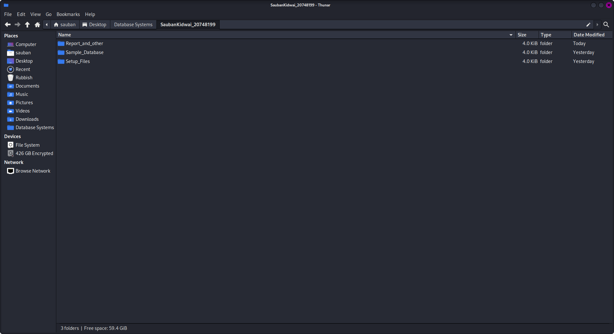
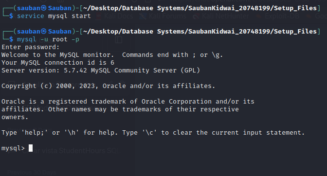
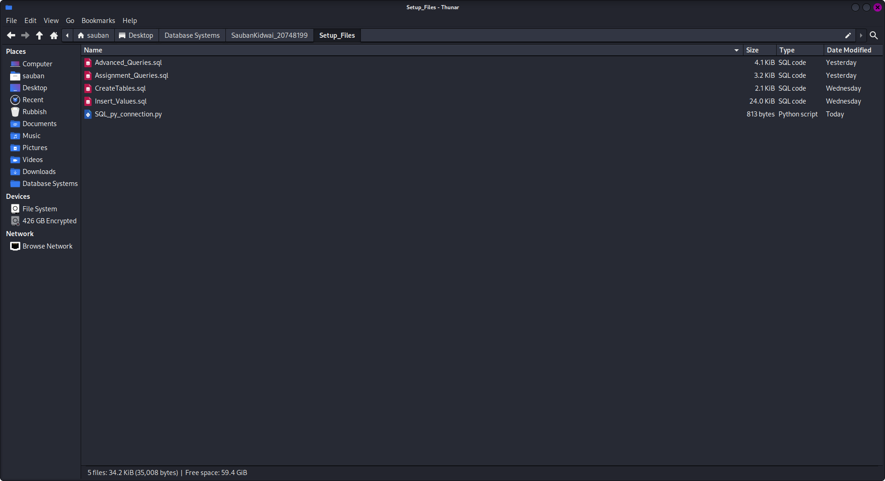
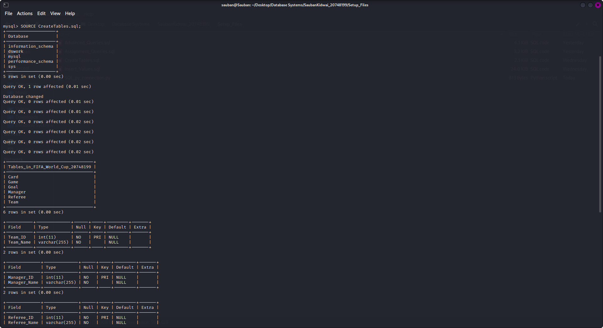
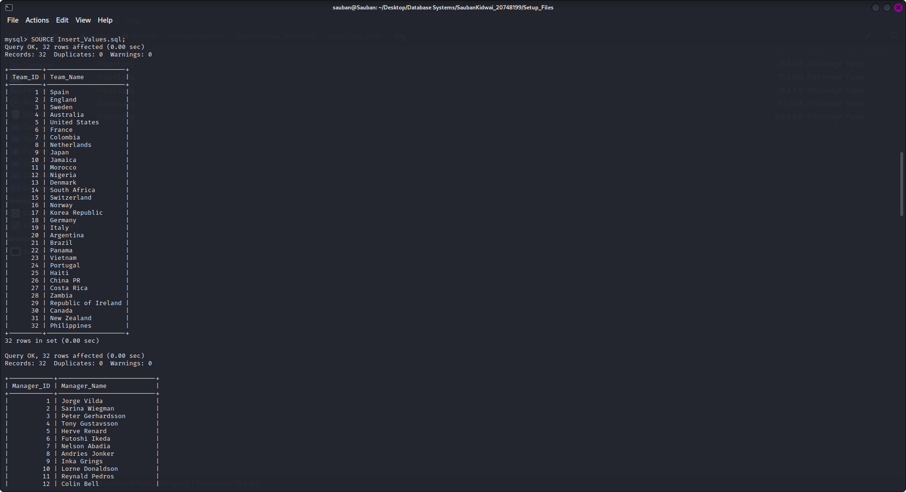

**<p style="text-align: center; font-size: 40px;">ISYS2014 - Database Systems</p>**

<p></p>

***<p style="text-align: center; font-size: 30px;">Final Assignment</p>***

<p>&nbsp;</p>
<p>&nbsp;</p>
<p>&nbsp;</p>
<p>&nbsp;</p>
<p>&nbsp;</p>
<p>&nbsp;</p>
<p>&nbsp;</p>
<p>&nbsp;</p>
<p>&nbsp;</p>


***<p style="text-align: center; font-size: 30px;">User Documentation</p>***


<p>&nbsp;</p>
<p>&nbsp;</p>
<p>&nbsp;</p>
<p>&nbsp;</p>
<p>&nbsp;</p>
<p>&nbsp;</p>
<p>&nbsp;</p>
<p>&nbsp;</p>


---------------------------------------------------------
#### By: Sauban Kidwai
#### ID: 20748199
#### Practical Class (Building: 314.114 | Time: 4pm - 6pm | Day: Every Wednesday)
----------------------------------------------------------


<div style="page-break-after: always"></div>


# Introduction <a name = Introduction></a>

This is the User guide that will help establish the Database.

# How to Use <a name = How_to_use></a>

1. First step is to ensure MySQL is installed in your system and is up to date.

2. Navigate to the Assignment Folder (in this case labeled SaubanKidwai_20748199)

3. Inside this directory there are 3 more directories - Report_and_other, Sample_Database and Setup_Files. Navigate to the Setup_Files folder. (As Shown in Figure 1)


*Figure 1*

4. Open a Terminal within this directory.


5. To Log into the MySQL Server, if not already active, you will have to activate the server. This command may vary with different Linux Installations. The system used to run this Assignment is Using Kali Linux. In the Command Line type in ```service mysql start``` as shown in Figure 1.


<p>&nbsp;</p>


*Figure 2*

<p>&nbsp;</p>
<p>&nbsp;</p>


6. It may ask you to enter your system password to start the server


7. Once that is done, type in the following command ```mysql -u root -p``` as shown in Figure 2. (This also may vary as it depends how the server was set up in your system).

8. Once done it will prompt you to enter your password.

9. Once the password has been entered, it should enter into the MySQL server as shown in Figure 3

<p>&nbsp;</p>


*Figure 3*

10. To establish the database, there are 2 files that we need to import. ```CreateTabels.sql``` and ```Insert_Values.sql``` as shown in Figure 4.

<p>&nbsp;</p>


*Figure 4*

11. To import the first file ```CreateTables.sql``` in the command line of the MySQL Serve, type in the following command ```SOURCE CreateTables.sql;```. Once this command has been type in it should show an output similar to figure 5, where it says Query OK and also shows the Description of all tables in the database called ```FIFA_World_Cup_20748199```.

<p>&nbsp;</p>


*Figure 5*

<p>&nbsp;</p>

12. This command creates the database, switches to the new database and then creates the tables required for this assignment. To Insert the values in to this database, run the following command ```SOURCE Insert_Values.sql```. When this command is run, it will insert values into the database and also show all the values in each table as shown in figure 6.

<p>&nbsp;</p>


*Figure 6*

13. To then run the queries to manipulate the data, run ```SOURCE Assignment_Queries.sql``` and then ```Advanced_Queries.sql```.


14. And thats is all the neccessary steps to establish the database.